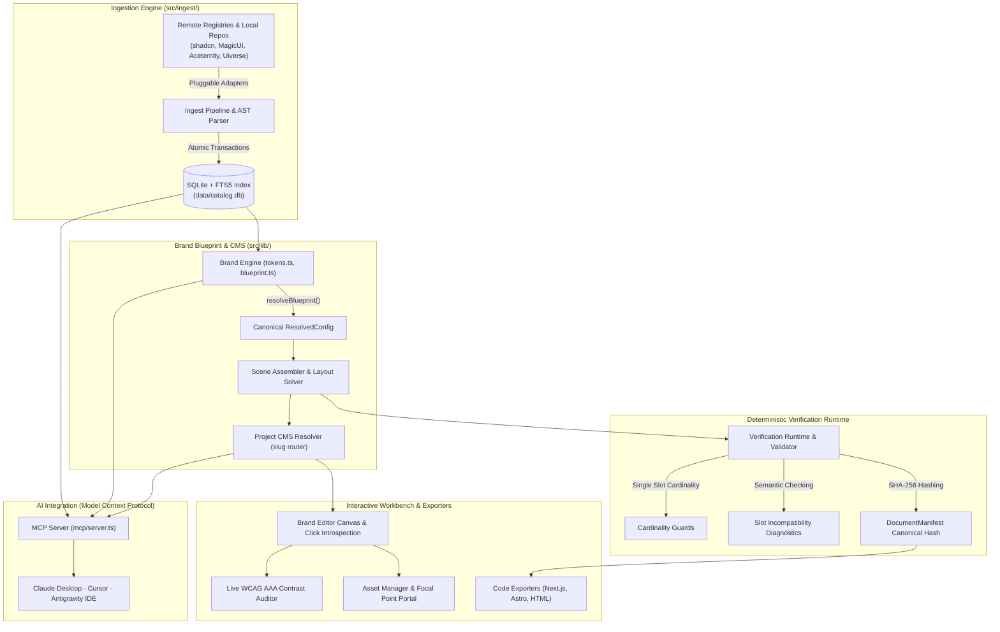

<div align="center">

# Golden Path Studio

**A local-first visual workbench and headless CMS for your UI. Catalog the real code of components from multiple sources into a local database, define a brand blueprint once, and hand both to your AI over MCP so it builds with your identity — offline, resilient, and deterministic.**

[](LICENSE)
[](https://nextjs.org)
[](https://react.dev)
[](https://www.typescriptlang.org)
[](https://tailwindcss.com)
[](https://www.sqlite.org)
[](https://modelcontextprotocol.io)
[](https://github.com/IvanjonasFC/Golden-Path-Studio/actions/workflows/ci.yml)

</div>

---

> [!IMPORTANT]
> **Local and offline by design.** The catalog, design system tokens, collections, and CMS entities live in a fast local SQLite database. Nothing is tracked or sent to external servers; your AI (Claude Desktop, Cursor, Antigravity) interfaces with your codebase locally through the open **Model Context Protocol (MCP)** standard.

## What is Golden Path Studio

Building modern web applications with AI coding assistants suffers from three critical bottlenecks:

1. **Ephemeral Registries & UI Fragmentation**: Modern UI components (shadcn/ui, Magic UI, Aceternity, HyperUI, Uiverse) are scattered across dozens of websites. If an author removes a repo or a registry changes its schema, your components break.
2. **The "Generic AI" Look**: Asking an AI to build from scratch results in repetitive, bland aesthetics lacking cohesive brand tokens, proper spacing, typography, and motion curves.
3. **Lack of AST-Level Verification**: AI tools hallucinate layout slots, mix incompatible design primitives, or ignore accessibility standards (WCAG AAA).

**Golden Path Studio** solves all three by providing an integrated, local-first environment:

* **Archive & Catalog**: An automated ingester archives the *real code* of components directly into a local SQLite database with **FTS5 full-text search**. Even if the original site disappears, your components remain accessible forever.
* **Brand Blueprint Engine**: Define tokens (colors, fonts, radii, motion, density) and high-level architectural decisions once. `resolveBlueprint()` merges presets, templates, and customizations into a single canonical source of truth.
* **Headless CMS & Dynamic Routing**: Manage structured project entities and portfolio pages (`/proyectos/[slug]`) via dynamic route resolution, with click introspection and live canvas editing.
* **Verification Runtime & Determinism**: Verifies slot cardinality, flags semantic mismatches, and embeds a **canonical document SHA-256 manifest hash** directly into exported code (Next.js, Astro, Pure HTML).
* **AI Bridge via MCP**: A dedicated **Model Context Protocol (MCP)** server exposes your entire catalog, brand tokens, and collections to Claude Desktop, Cursor, or Antigravity via stdio.

---

## Features

| Area | Route | What it does |
|------|-------|--------------|
| **Catalog & Archive** | `/` | Browse, search, and preview real component code with per-source attribution |
| **Full-Text Search** | `/` | Ultra-fast SQLite **FTS5** over name, tags, and description with faceted filters |
| **Brand Editor** | `/marcas/[id]` | Visual design-token workbench, live canvas preview, and slot layout assembler |
| **Project CMS** | `/proyectos/[slug]` | Headless entity-template engine with dynamic subpages and live introspection |
| **Asset Manager** | Modal / Portal | Centered viewport modal with 2D focal point canvas, crop preview, and WCAG ALT check |
| **Accessibility Auditor** | `/marcas/[id]` | Live WCAG 2.1 AA/AAA contrast analyzer with automated actionable suggestions |
| **Verification Runtime** | CLI / Lib | Deterministic SHA-256 document hashing, cardinality enforcement, and diagnostics |
| **Collections & Profiles**| `/colecciones` | Group components into Stack, Brand, or Project profiles with prompt generators |
| **Prompt Studio** | `/prompts` | High-converting design prompts, curated gradients, and interactive showcase |
| **shadcn/ui Registry** | `/r/[slug]` | Export any component or profile as a valid shadcn CLI registry endpoint |
| **MCP Server** | Stdio | 8 granular tools for LLM agent pair programming |

---

## Architecture



---

## Tech Stack

* **Core Framework**: Next.js 15 (App Router), React 19, TypeScript 5.
* **Styling**: Tailwind CSS 4, CSS Custom Properties Design Tokens, Zero-Emoji SVG Iconography.
* **Database & Persistence**: SQLite via `better-sqlite3`, Drizzle ORM, SQLite FTS5 Full-Text Virtual Tables.
* **Verification & Cryptography**: Deterministic SHA-256 canonical hashing via Node `crypto`, slot cardinality solver.
* **AI Integration**: `@modelcontextprotocol/sdk` (Stdio Transport).
* **Testing & Quality Assurance**: Custom automated verification test suites (`test-cms-pipeline.ts`, `test-verification-runtime.ts`).

<details>
<summary>Core Architecture Modules (<code>src/lib/</code>)</summary>

| Module | Responsibility |
|--------|----------------|
| `componentContract.ts` | Type definitions and normalizers for core primitives (Hero, Navbar, Metrics, Bento, Contact, Footer) |
| `projectDocument.ts` | Verification runtime, single-slot cardinality enforcement, semantic mismatch diagnostics, and SHA-256 document manifest generator |
| `projectCollectionResolver.ts` | Canonical project resolver, publication policy (drafts vs published), and dynamic route matching (`/proyectos/:slug`) |
| `portfolioProjects.ts` | Structured project CMS entity definitions, sanitizers, and universal ProjectDetailTemplate |
| `sceneAssembler.ts` | Full-page assembly pipeline with runtime mode guards and AST composition |
| `scenes.ts` | Slot topology definitions, conflict resolution options, and layout mutations |
| `tokens.ts` | Design token compilation, contrast calculation, and CSS token generation |
| `blueprint.ts` | Hierarchical blueprint resolution (`resolveBlueprint`), origin tracking, and golden paths |
| `brandExport.ts` | Next.js, Astro, and pure HTML/Tailwind export generators embedding DocumentManifests |
| `contrast.ts` | WCAG 2.1 contrast ratio calculator, APCA compliance, and suggestion generators |

</details>

---

## Getting Started

### Prerequisites

* **Node.js 20+** (v22 recommended) — verify with `node -v`
* **npm** or **pnpm**
* **git** on your `PATH`

### Installation & Local Setup

```bash
# 1. Clone the repository
git clone https://github.com/IvanjonasFC/Golden-Path-Studio.git
cd Golden-Path-Studio

# 2. Install dependencies
npm install

# 3. Configure environment
cp .env.example .env

# 4. Seed the database with canonical portfolio brand & projects
npm run db:seed

# 5. Launch development server
npm run dev
```

Open [http://localhost:3000](http://localhost:3000) in your browser.

### Ingestion Pipeline (Populating the Component Vault)

The database is populated through pluggable, idempotent adapters:

```bash
npm run ingest            # Ingest all sources (local + remote)
npm run ingest:local      # Ingest GitHub repositories (HyperUI, Uiverse, ThreeUI)
npm run ingest:remote     # Ingest registries (Magic UI, Aceternity, shadcn/ui, Cult)
npm run stats             # View facet counts by source, category, and framework
```

---

## Model Context Protocol (MCP) Setup

Golden Path Studio exposes an official **Model Context Protocol (MCP)** server over stdio. This enables AI tools (Claude Desktop, Cursor, Antigravity) to query your local components and build UIs matching your exact brand blueprint.

### Available MCP Tools

| Tool | Parameters | Description |
|------|------------|-------------|
| `search_components` | `query`, `category`, `source`, `framework`, `limit` | Searches the SQLite catalog via FTS5 and returns metadata with installation guides |
| `get_component` | `id` | Retrieves the full raw source code of a component, ready to paste |
| `list_catalog_facets` | *None* | Returns counts of available categories, sources, and platforms |
| `list_collections` | *None* | Lists all user collections and design profiles |
| `get_collection` | `id` | Retrieves all components in a collection along with their full code |
| `get_collection_prompt` | `id` | Generates a senior AI prompt instructed to use that exact stack and brand |
| `list_brands` | *None* | Lists all brand blueprints and compiled token registries |
| `get_brand` | `id` | Returns the complete compiled design tokens, effects, and slot configurations |

### Client Configuration

Add this configuration to your MCP settings file (e.g. `claude_desktop_config.json` or Antigravity `mcp_config.json`):

```json
{
  "mcpServers": {
    "golden-path-studio": {
      "command": "npx",
      "args": ["tsx", "/absolute/path/to/Golden-Path-Studio/mcp/server.ts"],
      "env": {
        "DB_PATH": "/absolute/path/to/Golden-Path-Studio/data/catalog.db"
      }
    }
  }
}
```

---

## Verification & Determinism Model

Every design in Golden Path Studio is governed by the **Verification Runtime**:

1. **Single Slot Cardinality**: Enforces that unique slots (such as Navbar or Main Hero) cannot have duplicate components without explicit conflict resolution.
2. **Semantic Mismatch Diagnostics**: Detects when a component type doesn't match its target scene (e.g. stats counter in a blog post) and offers one-click automated adaptation.
3. **Canonical Document Manifest**: Generates a deterministic SHA-256 hash representing the exact configuration, components, tokens, and revision number. This manifest is embedded into exports so any downstream tool can verify document integrity.
4. **Strict Zero-Emoji Policy**: Enforces clean, modern SVG vector iconography across all components for enterprise-grade visuals.

### Running Verification Tests

```bash
# Test the dynamic CMS entity and route resolver pipeline
npm run test:cms

# Test the Verification Runtime, cardinality guards, and document hashing
npm run test:verification
```

---

## Project Structure

```text
Golden-Path-Studio/
├── data/                                 # Catalogs, mockups, and prompts data
├── mcp/
│   └── server.ts                         # Stdio MCP Server (8 tools)
├── public/
│   ├── assets/                           # Asset library & media
│   ├── thumbnails/                       # Component preview thumbnails
│   └── vendor/                           # Vendored offline libraries (Three.js, Babel, Framer)
├── scripts/
│   ├── seed-portfolio-brand.ts           # Canonical portfolio brand seeder (10 CMS projects)
│   ├── sync-portfolio-db.ts              # SQLite database sync & normalization script
│   ├── test-cms-pipeline.ts              # 8-point CMS pipeline & route verification suite
│   ├── test-verification-runtime.ts      # Cardinality, AST hashing, & conflict resolution tests
│   └── scan-repo.ts                      # Repository scanner and ingester
├── src/
│   ├── app/                              # Next.js 15 App Router
│   │   ├── api/                          # REST API (brands, collections, components, exports)
│   │   ├── colecciones/                  # Collections and stack profile views
│   │   ├── marcas/                       # Brand Studio and visual canvas editor
│   │   ├── perfil/                       # User profile and settings
│   │   ├── prompts/                      # Prompt Studio & showcase
│   │   └── r/                            # Dynamic shadcn/ui registry endpoints
│   ├── components/
│   │   ├── AssetPickerModal.tsx          # Centered viewport React Portal for asset management
│   │   ├── BlockInspector.tsx            # Universal inspector with capability auto-discovery
│   │   ├── BrandEditor.tsx               # Visual canvas editor with click introspection
│   │   ├── CatalogClient.tsx             # FTS5 search catalog explorer
│   │   └── WcagLiveAuditor.tsx           # Live WCAG AAA contrast analyzer
│   ├── db/
│   │   └── index.ts                      # SQLite client & Drizzle ORM schema
│   ├── ingest/                           # Pluggable ingesters (shadcn, Uiverse, MagicUI)
│   └── lib/
│       ├── componentContract.ts          # Core component interfaces & prop normalizers
│       ├── portfolioProjects.ts          # CMS entity schemas & ProjectDetailTemplate
│       ├── projectCollectionResolver.ts  # Dynamic route resolver & publication policy
│       ├── projectDocument.ts            # Verification runtime & SHA-256 document hashing
│       └── tokens.ts                     # Design token compiler & color matrix solver
├── .env.example
├── CHANGELOG.md
├── CONTRIBUTING.md
├── LICENSE                               # MIT License
└── package.json
```

---

## License

Distributed under the [MIT](LICENSE) license. All bundled component code preserves original author attributions as documented in [NOTICE](NOTICE).
