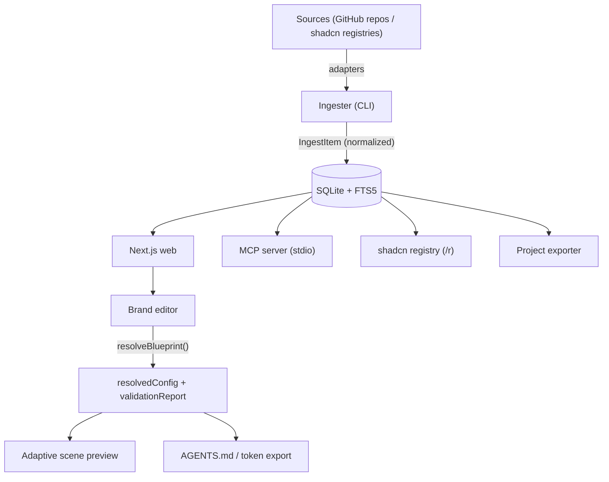

# Architecture

Golden Path Studio is a local-first Next.js application built around a single
principle: **one normalized store, many consumers**. This document explains the
data model, the resolution layer, and the design decisions behind them.

## Overview



## Data model

The catalog is a single table (`components`): one row per component, carrying its
`source`, `platform`, `framework`, `category`, `tags`, `dependencies`,
`installCommand`, `license`, `author`, `sourceUrl` and — the important part — `files`,
the **complete source code** stored as JSON. Because the code is stored in full, the
catalog keeps working even if the original website goes offline.

Full-text search is backed by SQLite **FTS5** over name, tags and description. The
same query layer (`src/lib/query.ts`) is used by the web, the MCP server and the
shadcn registry, so there is a single search implementation, not three.

Brands and collections are stored alongside the catalog. A **brand** is a design-token
system plus a blueprint of decisions; a **collection** is a profile (Stack, Brand or
Project) that references catalog components by id — reuse is by reference, never by
duplication.

## Ingest (pluggable adapters)

Each source has an adapter under `src/ingest/` that returns normalized `IngestItem`s;
the orchestrator (`src/ingest/index.ts`) wipes and reinserts each source, so ingest is
idempotent and re-runnable. Sources that publish a shadcn registry reuse
`makeShadcnAdapter`, so adding one is a single line of config. No fragile HTML scraping
is used — content is read from structured sources (GitHub repos or JSON registries).

## The resolution layer

The brand editor never consumes the raw per-tab draft. Instead, `resolveBlueprint()`
(`src/lib/resolve.ts`) merges four layers with a strict precedence:

```
draft > template > preset > default
```

Every resolved field is tagged with its **origin** (custom / template / preset /
default / missing). The resolver returns a `resolvedConfig` plus a `validationReport`:
defaults fill optional fields, but a missing *required* field is a real blocker that
stops publishing. This is what lets the UI distinguish an inherited value from a
deliberate decision, and what makes coverage honest.

`resolvedConfig` is the single source of truth for three consumers: the preview, the
token/`AGENTS.md` export, and the AI instructions delivered over MCP.

## Scenes and slots

A scene (Brand, Landing, Dashboard, Login, Form, Mobile, States) is defined by a set
of **slots** (`src/lib/scenes.ts`). Each slot has a compatible category set, a render
mode (persistent / triggered / structural), and may be **dynamic** — existing only
when the resolved config enables a capability.

The scene preview renders as real HTML that consumes `resolvedConfig`, so navigation,
search vs command palette, filters, pagination, cards vs table, wizard steps, auth
methods, motion and density all change the canvas. `sceneSlotsResolved()` is the single
source of zones (base + active dynamic) consumed by both the preview and the builder.

Robustness rules, enforced everywhere:

- Component assignments are stored by reference in `blueprint.slots[scene][slotId]`.
- Turning a capability off hides its dynamic zone but **never deletes** the assignment;
  it becomes a preserved "pending" zone that returns when the capability is re-enabled.
- An assignment to an unknown slot id surfaces as an "orphan" for manual review — it is
  never silently removed.

## Consumers

- **Web** (`src/app/`) — catalog, collections, brand editor, and the `/r` shadcn
  registry routes.
- **MCP server** (`mcp/server.ts`) — eight read-only tools over the same store.
- **Exporter** (`src/lib/brandExport.ts`) — writes tokens, `AGENTS.md` and full project
  scaffolds to `./exports/<slug>/`.

## Design decisions

- **Local-first.** The store is a SQLite file on disk; nothing is uploaded. The AI reads
  the local database, not the internet.
- **One engine.** Search, resolution and rendering each have a single implementation
  shared by every surface — no parallel pipelines to drift apart.
- **Deterministic and traceable.** Inferred values travel with their origin and are
  validated; the system never silently overwrites a real requirement with a default.
- **Incremental.** Features are added as adapters, slots and layers — no big-bang
  rewrites.
